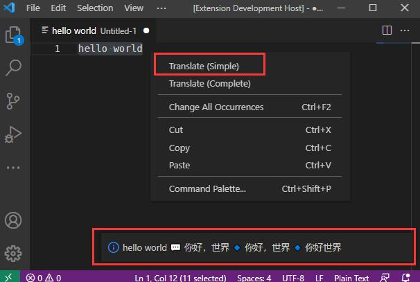
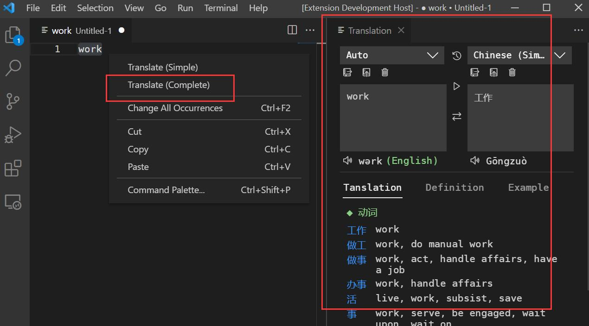
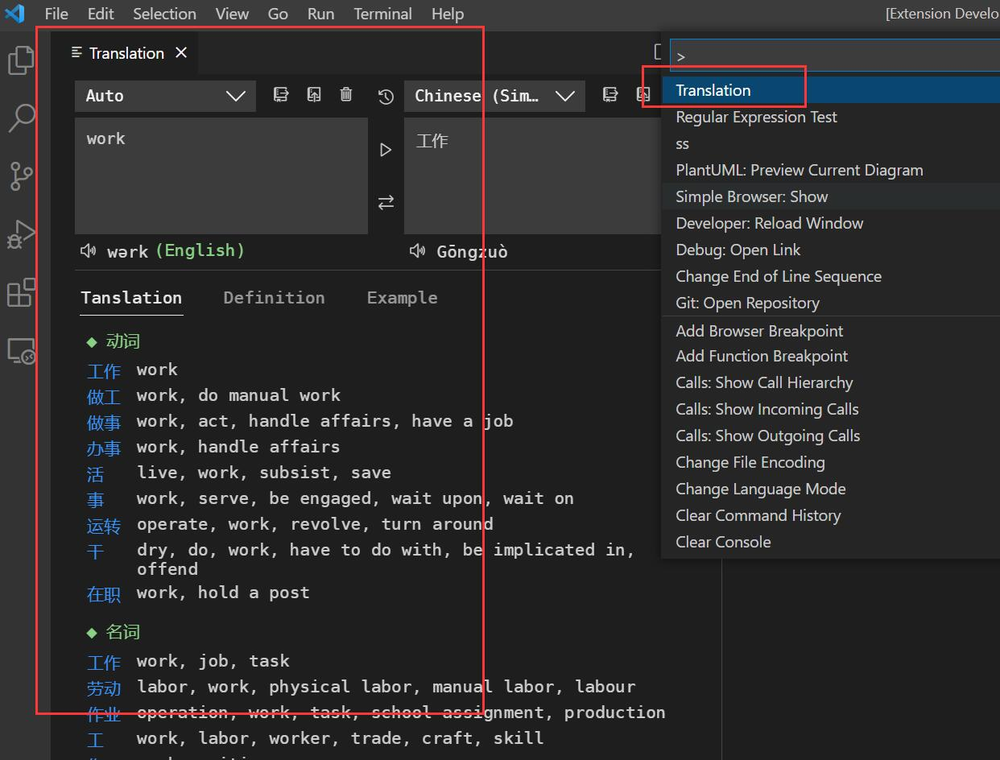
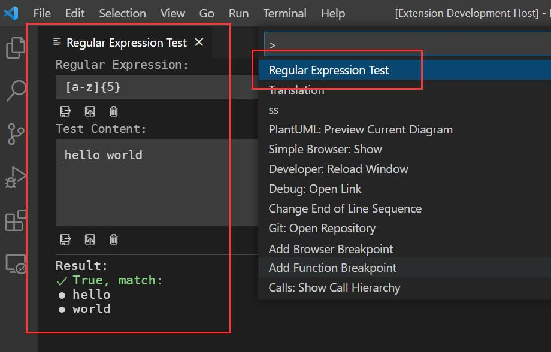

# vscode-translation
This extension provides translation (based on Google Translation) support for Visual Studio Code.

[Get from Marketplace](https://marketplace.visualstudio.com/items?itemName=caiqichang.vscode-translation)

## Features
- Multiple languages translation support.
- Words or sentences (support multiple lines, limit in 200 words each time) translation support.
- [Settings](#settings)
- [Simple Translation](#simple-translation)
- [Complete Translation](#complex-translation)
- Extra
  - [Regular Expression Test](#regular-expression-test)

## Usage
### Settings
```javascript
{
  // Default source language for translation.
  "translation.source-language": "auto",

  // Default target language for translation.
  "translation.target-language": "en"
}
```

[Back to top](#features)

### Simple Translation
- Select text in editor and right click, choose `Translate (Simple)`,
and the translation for selected text will be showed in notification.



[Back to top](#features)

### Complete Translation
- Select text in editor and right click, choose `Translate (Complete)`,
and the translation for selected text will be showed in Translation panel.



- Use command `Translation` to open Translation panel.



[Back to top](#features)

### Regular Expression Test
- Use command `Regular Expression Test` to open Regular Expression Test panel.



[Back to top](#features)

