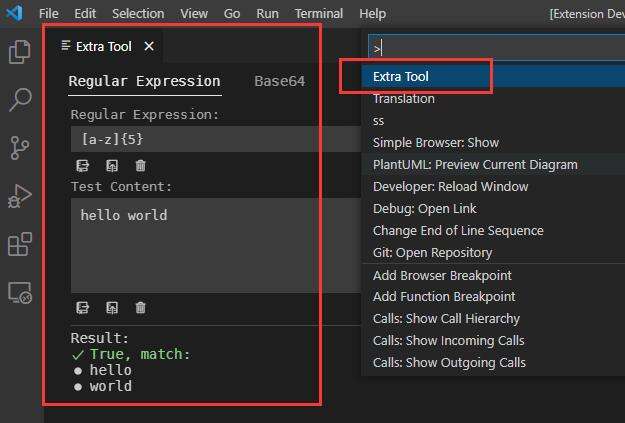

# vscode-translation

English | [简体中文](README.zh-CN.md)

This extension provides translation (based on [Google Translation](https://translate.google.com)) support for Visual Studio Code.

[Get from Marketplace](https://marketplace.visualstudio.com/items?itemName=caiqichang.vscode-translation)

## Features
- Multiple languages translation support
- Words or one sentence (support multiple lines, limit in 200 characters each time) translation support
- Pronunciation support ([FFmpeg](https://ffmpeg.org) is required)
- HTTP proxy support
- [Settings](#settings)
- [Simple Translation](#simple-translation)
- [Complete Translation](#complete-translation)
- [Extra Tool](#extra-tool)
  - Regular Expression Test
  - Base64 Encode and Decode
- Getting ss list from URL

## Usage
### Settings
```javascript
{
  // Default source language for translation.
  "translation.source-language": "auto",

  // Default target language for translation.
  "translation.target-language": "en",

  // Controls whether to use http proxy for translation.
  "translation.enable-proxy": false,

  // URL for http proxy.
  "translation.proxy-url": "http://127.0.0.1:1080",

  // ss list, each item include properties: url(string), enabkeProxy(boolean), enableBase64Decode(boolean).
  "translation.ss": [],
}
```

<details>
<summary>Value of source language and target language</summary>
<table>
<thead>
<tr><th>Language</th><th>Value</th></tr>
</thead>
<tbody>
<tr><td>Auto</td><td>auto (source language only)</td></tr>
<tr><td>Afrikaans</td><td>af</td></tr>
<tr><td>Albanian</td><td>sq</td></tr>
<tr><td>Amharic</td><td>am</td></tr>
<tr><td>Arabic</td><td>ar</td></tr>
<tr><td>Armenian</td><td>hy</td></tr>
<tr><td>Azerbaijani</td><td>az</td></tr>
<tr><td>Basque</td><td>eu</td></tr>
<tr><td>Belarusian</td><td>be</td></tr>
<tr><td>Bengali</td><td>bn</td></tr>
<tr><td>Bosnian</td><td>bs</td></tr>
<tr><td>Bulgarian</td><td>bg</td></tr>
<tr><td>Catalan</td><td>ca</td></tr>
<tr><td>Cebuano</td><td>ceb</td></tr>
<tr><td>Chichewa</td><td>ny</td></tr>
<tr><td>Chinese (Simple)</td><td>zh-CN</td></tr>
<tr><td>Chinese (Traditional)</td><td>zh-TW</td></tr>
<tr><td>Corsican</td><td>co</td></tr>
<tr><td>Croatian</td><td>hr</td></tr>
<tr><td>Czech</td><td>cs</td></tr>
<tr><td>Danish</td><td>da</td></tr>
<tr><td>Dutch</td><td>nl</td></tr>
<tr><td>English</td><td>en</td></tr>
<tr><td>Esperanto</td><td>eo</td></tr>
<tr><td>Estonian</td><td>et</td></tr>
<tr><td>Filipino</td><td>tl</td></tr>
<tr><td>Finnish</td><td>fi</td></tr>
<tr><td>French</td><td>fr</td></tr>
<tr><td>Frisian</td><td>fy</td></tr>
<tr><td>Galician</td><td>gl</td></tr>
<tr><td>Georgian</td><td>ka</td></tr>
<tr><td>German</td><td>de</td></tr>
<tr><td>Greek</td><td>el</td></tr>
<tr><td>Gujarati</td><td>gu</td></tr>
<tr><td>Haitian Creole</td><td>ht</td></tr>
<tr><td>Hausa</td><td>ha</td></tr>
<tr><td>Hawaiian</td><td>haw</td></tr>
<tr><td>Hebrew</td><td>iw</td></tr>
<tr><td>Hindi</td><td>hi</td></tr>
<tr><td>Hmong</td><td>hmn</td></tr>
<tr><td>Hungarian</td><td>hu</td></tr>
<tr><td>Icelandic</td><td>is</td></tr>
<tr><td>Igbo</td><td>ig</td></tr>
<tr><td>Indonesian</td><td>id</td></tr>
<tr><td>Irish</td><td>ga</td></tr>
<tr><td>Italian</td><td>it</td></tr>
<tr><td>Japanese</td><td>ja</td></tr>
<tr><td>Javanese</td><td>jw</td></tr>
<tr><td>Kannada</td><td>kn</td></tr>
<tr><td>Kazakh</td><td>kk</td></tr>
<tr><td>Khmer</td><td>km</td></tr>
<tr><td>Kinyarwanda</td><td>rw</td></tr>
<tr><td>Korean</td><td>ko</td></tr>
<tr><td>Kurdish</td><td>ku</td></tr>
<tr><td>Kyrgyz</td><td>ky</td></tr>
<tr><td>Lao</td><td>lo</td></tr>
<tr><td>Latin</td><td>la</td></tr>
<tr><td>Latvian</td><td>lv</td></tr>
<tr><td>Lithuanian</td><td>lt</td></tr>
<tr><td>Luxembourgish</td><td>lb</td></tr>
<tr><td>Macedonian</td><td>mk</td></tr>
<tr><td>Malagasy</td><td>mg</td></tr>
<tr><td>Malay</td><td>ms</td></tr>
<tr><td>Malayalam</td><td>ml</td></tr>
<tr><td>Maltese</td><td>mt</td></tr>
<tr><td>Maori</td><td>mi</td></tr>
<tr><td>Marathi</td><td>mr</td></tr>
<tr><td>Mongolian</td><td>mn</td></tr>
<tr><td>Myanmar</td><td>my</td></tr>
<tr><td>Nepali</td><td>ne</td></tr>
<tr><td>Norwegian</td><td>no</td></tr>
<tr><td>Pashto</td><td>ps</td></tr>
<tr><td>Persian</td><td>fa</td></tr>
<tr><td>Polish</td><td>pl</td></tr>
<tr><td>Portuguese</td><td>pt</td></tr>
<tr><td>Punjabi</td><td>pa</td></tr>
<tr><td>Romanian</td><td>ro</td></tr>
<tr><td>Russian</td><td>ru</td></tr>
<tr><td>Samoan</td><td>sm</td></tr>
<tr><td>Scots Gaelic</td><td>gd</td></tr>
<tr><td>Serbian</td><td>sr</td></tr>
<tr><td>Sesotho</td><td>st</td></tr>
<tr><td>Shona</td><td>sn</td></tr>
<tr><td>Sindhi</td><td>sd</td></tr>
<tr><td>Sinhala</td><td>si</td></tr>
<tr><td>Slovak</td><td>sk</td></tr>
<tr><td>Slovenian</td><td>sl</td></tr>
<tr><td>Somali</td><td>so</td></tr>
<tr><td>Spanish</td><td>es</td></tr>
<tr><td>Sundanese</td><td>su</td></tr>
<tr><td>Swahili</td><td>sw</td></tr>
<tr><td>Swedish</td><td>sv</td></tr>
<tr><td>Tajik</td><td>tg</td></tr>
<tr><td>Tamil</td><td>ta</td></tr>
<tr><td>Telugu</td><td>te</td></tr>
<tr><td>Thai</td><td>th</td></tr>
<tr><td>Turkish</td><td>tr</td></tr>
<tr><td>Turkmen</td><td>tk</td></tr>
<tr><td>Ukrainian</td><td>uk</td></tr>
<tr><td>Urdu</td><td>ur</td></tr>
<tr><td>Uzbek</td><td>uz</td></tr>
<tr><td>Vietnamese</td><td>vi</td></tr>
<tr><td>Welsh</td><td>cy</td></tr>
<tr><td>Xhosa</td><td>xh</td></tr>
<tr><td>Yiddish</td><td>yi</td></tr>
<tr><td>Yoruba</td><td>yo</td></tr>
<tr><td>Zulu</td><td>zu</td></tr>
</tbody>
</table>
</details>

[Back to top](#features)

### Simple Translation
- Select text in editor and right click, choose `Translate (Simple)`,
and the translation for selected text will be shown in notification.


[Back to top](#features)

### Complete Translation
- Select text in editor and right click, choose `Translate (Complete)`,
and the translation for selected text will be shown in Translation panel.


- Use command `Translation` to open Translation panel.


[Back to top](#features)

### Extra Tool
- Use command `Extra Tool` to open Extra Tool panel.



[Back to top](#features)

